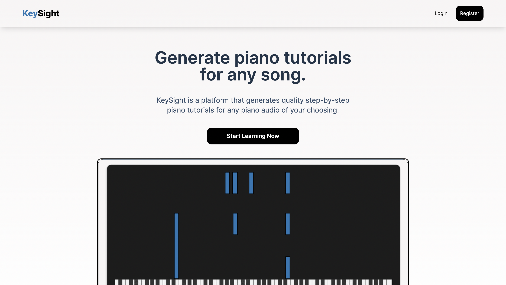

# KeySight



KeySight helps people learn the piano by transcribing any piano audio of their choosing and visualizing it with a custom-made video editor.

If you have ever struggled to find a YouTube tutorial for a song you love, or want to visualize a great piano cover you have heard, then this is the application for you!

## Table of Contents

- [Tech Stack](#Tech-Stack)
- [Usage](#usage)

## Tech Stack

[Python](https://www.python.org/) and [JavaScript](https://en.wikipedia.org/wiki/JavaScript) are the main languages used, but we use a variety of frameworks to make development and performance better.

##### Frontend

- [Next.js](https://nextjs.org/) for server-side rendering capabilities and SEO benefits
- [TailwindCSS](https://tailwindcss.com/) to make styling faster

##### Backend

- [Node.js](https://nodejs.org/en) and [Express.js](https://expressjs.com/) to build the REST API's that lie in some of the services
- [FastAPI](https://fastapi.tiangolo.com/) for quick API responses and help KeySight utilize Python's machine learning capabilities
- [PostgreSQL](https://www.postgresql.org/) for our primary data store
- [Magenta's Piano Transcription Model](https://magenta.tensorflow.org/onsets-frames) to transcribe piano audio to MIDI output

## Usage

First, you will need to pull the GitHub repo with the following command

```bash
# Clone the repository
git clone https://github.com/sebat2004/keysight.git
```

##### Frontend

If you want to see how the app looks, take the following steps to start up the [Next.js](https://nextjs.org/) application.

```bash
# Change into the web directory
cd keysight/web

# Install dependencies
npm install

# Run the project
npm run dev
```

##### Backend

If you want to interact with the different services we have, follow the next few steps to start up each service. (There will me a Docker Compose file in the near future to make this much easier).

```bash
# Change into the services directory
cd keysight/services
```

##### Users microservice

Follow if you want to perform CRUD actions as a user

```bash
# Change into the user directory
cd users

# Install dependencies
npm install

# Create a .env file
touch .env

# Add a DATABASE_URL env variable to connect to a PostreSQL database

# Start the application
npm run start

```
